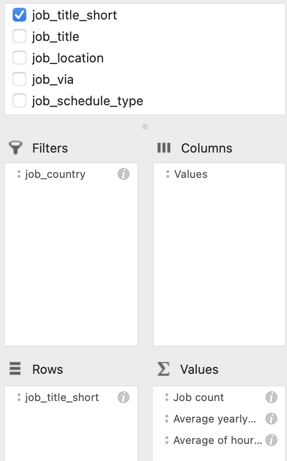

# Introduction 

The following dataset was used in order to demostrate the set of skills which was applied during executing of the following tasks.

Main objective: demonstrate the advanced level of Excel

**Dataset consists of the follwing columns**:

job_title_short
job_title
job_location
job_via
job_schedule_type
job_work_from_home
search_location
job_posted_date
job_no_degree_mention
job_health_insurance
job_country
salary_rate
salary_year_avg
salary_hour_avg
company_name
job_skills

# 1 - DashBoard 

File named **dashboard.xlsx** contains all the steps which were taken during creation of this dashboard.

Sheets such as Median_Salary, Basic_Calculator, Data_Validation, Validation, title, country, type, platform  will guide you trought the whole path of making this dashboard.

Sheet named **Calculator** is dashboard visualization inself.

This dashboard offers several key benefits for anyone interested in data science salaries:

**Customized Salary Insights:** Users can quickly filter by specific Job title (like "Senior Data Engineer"), Country (e.g., "United States"), and Job type (e.g., "Full-time") to get highly relevant salary data, such as a "Median Salary" of £150,000.

**Market Benchmarking:** It serves as a valuable tool for understanding current market rates for various data science roles, assisting both job seekers in salary negotiations and employers in competitive compensation planning.

**Comparative Analysis:** The included bar chart visualizes salary ranges across different Job type categories (Part-time, Temp work, Full-time, Contractor), allowing for easy comparison.

**Geographical Context:** The presence of a map, alongside filters, allows to explore how salaries vary by location, providing crucial geographical insights.

**Data-Driven Decision Making:** By providing quick access to aggregated salary information, the dashboard empowers users to make more informed career or hiring decisions

# 2 Conditional Formating

The conditional formatting on the "Data Science Job Count Tracker" table serves to:

**Visually Highlight Trends**: Green and red coloring instantly shows high or low job counts for a role in a given month.

**Identify Hot/Cold Periods**: Easily spot consistent peaks (e.g., August for Data Analyst) or lows (e.g., Nov/Dec).

**Draw Attention:** Color intensity guides the eye to the highest and lowest numbers.

**Provide Quick Insights:** Understand monthly fluctuations and job market health at a glance, complemented by sparklines.

**Complemented by sparklines on the right which show a visual trend over the year for each role.**
# 3 Tables (Slicers)

Slicers empower users to interactively refine the displayed salary data, making the dashboard highly customizable and relevant to specific job search, hiring, or market research needs.

**Job title:** This slicer allows users to select and filter salary data by specific roles within data science, such as "Senior Data Engineer," "Data Scientist," "Data Analyst," and "Machine Learning Engineer." This helps users focus on the roles most relevant to their inquiry.

**Country:** This slicer enables users to narrow down the salary information by geographical location.

**Job type:** This slicer provides the ability to filter by employment type, with "Full-time" currently selected. Other options like "Part-time," "Temp work," and "Contractor" are likely available. This allows users to compare salaries based on different employment arrangements.

**In addition to the slicers, the dashboard also features a histogram titled "How much do Data Science jobs make?". This visualization displays the distribution of salaries, showing the frequency  within different salary ranges. It helps users understand where most salaries fall and identify common salary brackets.**

# 4 Add-ins:
## What-If Analysis (Scenario Manager)

***What-if analysis*** is a powerful technique used in spreadsheets, such as the one displayed, to model and explore different financial scenarios. The dashboard is structured with clear Input Cells for key variables like Base Salary, Bonus, and Annual Raise, which can be easily adjusted to test assumptions. The Result Cells then automatically calculate the corresponding outcomes over time, driven by a formula like =(base*(1+raise)^B9)*(1+bonus), which calculates the amount for each year based on the inputs. This allows users to quickly answer questions like, "What if I received a different bonus or raise?". 

***The Scenario Summary*** table further extends this capability by presenting the results of multiple what-if scenarios side-by-side, enabling a direct comparison of different job offers or financial plans to make informed decisions.

## Solver

So, we've talked about what-if analysis, where we change inputs to see what happens. Now, let's look at something more powerful: **Solver**. Think of it as a reverse what-if tool.

Instead of asking, 'What will happen if...?', Solver allows us to ask, 'What do we need to do to achieve a specific goal?'.

For example, our objective was to increase our total salary to £640,000. We set that as our goal. Solver then worked backwards, telling us exactly what combination of inputs would get us there. It figured out we would need a 20% bonus and a 3.2% raise to hit that target, which is a big jump from our original 10% bonus and 1.5% raise.

Importantly, it does all this while respecting any rules or constraints we set, ensuring the solution is realistic.

In short, Solver helps us move from just exploring different options to finding the best possible solution to a problem.

## What-If Analysis (Data Table)

This is a simple but powerful tool for financial planning. It allows us to compare multiple scenarios at once by changing just one variable—in this case, the Annual Raise from 0% to 4%. This lets us instantly see the impact of each scenario on our total salary, making it easy to plan and understand how sensitive our earnings are to that one change.

This is a more advanced version of our what-if analysis, where we use a data table to change two inputs at once.

In this view, we're not just changing the Annual Raise; we're also changing the Bonus. The rows represent different Annual Raise scenarios, while the columns represent different Bonus scenarios.

This allows us to instantly see how the Total Salary is impacted by the combination of these two variables. You can quickly find the total amount for any given combination, and the color coding helps us easily spot which scenarios yield the highest total earnings.

# Pivot Tables and Charts

Instead of looking through thousands of individual records, we can **'pivot'** our data to get a clear overview. Here, we've organized the information by job title. 

For each job, the table instantly calculates three key metrics: **the total Job count, the Average yearly salary, and the Average of hourly salary.**

We can also use the job_country filter to change the entire report with a single click, allowing us to focus on specific markets and make a direct comparison. It's a highly efficient way to turn raw data into a readable, actionable report."

To create the above talbe , we used a **PivotTable**, which allows us to summarize data from a large dataset. Here, we have not only organized the job roles as our rows and the months as our columns, but we have also grouped similar jobs together into **Group1, Group2, and Group3** to make a high-level comparison even easier.

This allows us to quickly spot peak hiring months, like August, and identify slower periods, such as November and December, for each specific role. We can also use the **job_country filter** to adjust the entire report to a specific region, making this a very effective way to understand hiring cycles at a glance."" 

Above is a more detailed report that shows us a breakdown of data by multiple categories at once.

Here, we've organized the **information hierarchically**: starting with the country, then showing our different job groups, and finally the individual job titles.

For each of these categories, we can instantly see two key metrics: **the Salary year average** and **the Job count**. This allows us to easily compare salary trends and job availability for specific roles across different countries, giving us a very powerful tool for market analysis."

**The chart below helps us answer the question: 'How are jobs trending over time?'**

The line chart shows the total number of jobs available **each month**. The real power of this view, however, comes from the **timeline** at the bottom. This interactive tool allows us to easily select and change the period we're analyzing.

For instance, we can see the trend from March to September. If we wanted to, we could simply drag the timeline to see the data for a single quarter, or extend it to view the entire year's trend. It makes our data dynamic and easy to explore for any time frame we're interested in.

**Below is an interactive dashboard that lets us analyze job market data on the fly**

The main interactive tools here are the **slicers on the right side**. These user-friendly filters allow us to quickly change what we're looking at with a single click.

In this view, we've used the slicers to filter our data to show us the breakdown of jobs in Australia and specifically for the Senior Data Nerds group.

The bar chart then visualizes the results, showing us the percentage distribution of each senior role within that group. This allows us to get instant insights into the composition of the job market for any country or job group we choose.

**The chart below  gives us a quick answer to the question: 'What is the top-paying jobs in Data Science?'**

By comparing the average yearly salaries of key senior roles, we can clearly see that **Senior Data Scientist** is the highest-paying role among the three, followed by Senior Data Engineer and Senior Data Analyst. It’s a very straightforward way to visualize and understand the salary hierarchy 

# Power Query - Part 1 

## Section 1
We started by connecting to a raw data file called **'01_Jan_data_jobs.xlsx'**  and bringing it into our Power Query editor. The first thing we did was prepare the data by making sure the column headers were correct and that each column was using the right data type, such as text for job titles and currency for salary.

Next, we focused on cleaning and transforming the data. We performed a text cleanup to remove the phrase **'via'** from the job_via column. Then, we created two new, very useful columns:

**Job_posted_day**, which extracts just the day number from the full date a job was posted.

**Salary_adjusted**, which takes the average hourly salary and converts it to an approximate yearly salary for easy comparison.

Finally, we organized our finished data. We added a unique **job_id** to each record and reordered all the columns to present a clean, logical table for our analysis."

## Section 2

We started by isolating and organizing the key information we needed to analyze job skills. We used Power Query's **Table.SelectColumns** function to create a new sheet focused only on job skills, titles, and IDs.

The raw skills data was messy, likely stored as a text list with brackets and quotes. We used **Table.ReplaceValue** multiple times to clean up this text by removing characters like [, ], and '.

The most powerful part of this process was restructuring the data. First, we used **Table.SplitColumn** to break the comma-separated list of skills into up to 21 new columns. This turned one row of skills into a single-skill-per-column format. The critical next step was to **unpivot** this table. This converted our wide table into a long one, where each individual skill now has its own dedicated row. This is a crucial step that makes it possible to accurately count and analyze the frequency of each skill.

Finally, we performed a thorough cleanup to ensure data quality. We used **Text.Trim** to remove any extra spaces, **Text.Proper** to standardize capitalization, and a conditional column to specifically correct the formatting of important acronyms like 'SQL', 'AWS', and 'Power BI'. This ensures our final skills data is perfectly clean and consistent for analysis."

## Section  3

First, we used the **Table.Group** function to group all of our job skills data together. This allowed us to efficiently count how many times each unique skill appeared in our dataset. 

We then used the **Table.Sort** function to arrange that list in descending order, putting the most frequently mentioned skills at the top. Finally, with **Table.FirstN**, we selected just the top 10 skills from the sorted list, giving us a clear and concise view of the most in-demand skills.

## Section 4 

First, we performed a join by using **Table.NestedJoin** to merge two tables. We brought the cleaned and restructured job skills data back into our main table using the **job_id** as the common **identifier**. The join type, **JoinKind.FullOuter**, ensured we kept all the data from both tables.

Afterward, we expanded that merged data to make the **Job_skills** column visible in our main table. Finally, we used a conditional column to create a new, consolidated **Salary_combined column**. This column intelligently combines our salary data by first using the official yearly salary and then automatically filling in any missing values with our previously calculated Salary_adjusted figure.

This entire process created a single, complete, and robust dataset ready for final analysis.

# Power Query - Part 2

## Author  
Created by **Arsen Pankiv**  
- [LinkedIn](https://www.linkedin.com/in/arsen-pankiv-6082b4349/)  
- [GitHub](https://github.com/Arsen-Pankiv)

**Questions and database provided by:**  
- [Luke Barousse](https://www.linkedin.com/in/luke-b/)
